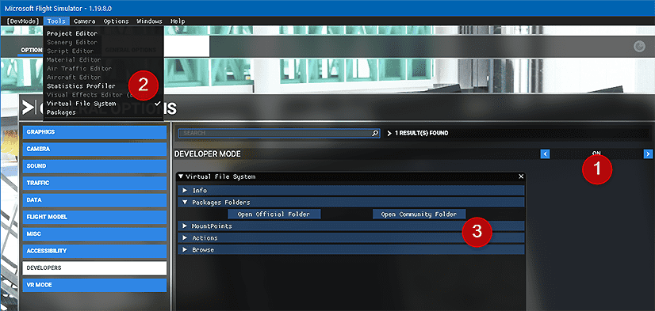

# Frequently Asked Questions

## Installation


### Downloads

<div class="grid cards" markdown>
-   **Download C-17A**  
    Current Development Version

    [](https://github.com/Delta-Simulations/MSFS-C-17/releases/latest)
    
    Click on the :octicons-package-16:```deltasimulations-c17.zip``` file to download
    
    [Download the C-17A](https://github.com/Delta-Simulations/MSFS-C-17/releases/latest){ .md-button }

-   **Download UH-60M**  
    Current Development Version

    [](https://github.com/Delta-Simulations/MSFS-H-60M/releases/latest)

    Click on the :octicons-package-16:```deltasimulations-uh60.zip``` file to download
    
    [Download the UH-60M](https://github.com/Delta-Simulations/MSFS-H-60M/releases/latest){ .md-button }
</div>

__Please follow ALL steps in this section if you encounter any issues with installation before seeking support.__
Open __and extract__ the zip that you downloaded from one of the links above, and drag the `deltasimulations-XXX` folder inside the zip into your Community folder.

See below for the location of your Community folder.
### Community Folder

#### :material-microsoft: Microsoft Store and/or Game Pass Edition
 - Copy the `deltasimulations-XXX` folder into your community package folder.

It is located in:

    C:\Users\[YOURUSERNAME]\AppData\Local\Packages\Microsoft.FlightSimulator_<RANDOMLETTERS>\LocalCache\Packages\Community.

#### :simple-steam: Steam Edition
 - Copy the `deltasimulations-XXX` folder into your community package folder.

It is located in:

    C:\Users\[YOUR USERNAME]\AppData\Roaming\Microsoft Flight Simulator\Packages\Community.

#### :material-store: Boxed Edition
- Copy the `deltasimulations-XXX` folder into your community package folder.

It is located in:

    C:\Users\[YOUR USERNAME]\AppData\Local\MSFSPackages\Community.

### Troubleshooting
If the above methods do not work:

{ width="full" }
To find the Community folder that MSFS is using, please follow these steps:

1. Go to your General Settings in MSFS and activate Developer Mode.
1. Go to the menu and select 'Virtual File System'.
1. Click on 'Packages Folders' and select 'Open Community Folder'.
This opens the Community folder in a Windows Explorer. Please ensure that your add-ons are installed in the folder that is opened.

### Clean Install
If you would like to manually perform a clean install you have to delete the `deltasimulations-XXX` folder from your community folder.

## How do I report an issue?

!!! warning "CHECK THIS FIRST"
    ## Before Reporting Issues
    Please try removing all other mods/liveries from the community folder and test our add-on again. This will help rule out conflicts.
    
    **Most reported issues are caused by conflicts with other mods and liveries. If this does not resolve your issue, please continue below.**